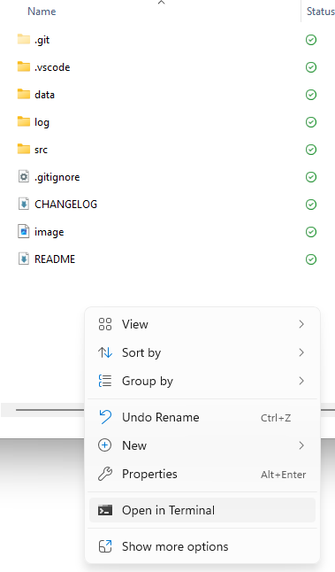

# Data Validation QA Script

A data validation tool that validates data against configurable rules in Excel files.

## Overview

This script validates data from Excel files against a set of predefined rules to ensure data quality and consistency. It supports various validation scopes including full dataset validation, date-based partitioning, and conditional validation. 

Core validation logics are from the Cerberus validation library.

## Project Structure

```
qa_script/
├── src/
│   └── data_validation.py    # Main validation script
├── data/
│   ├── data_validation_rules - template.xlsx  # Validation rules template (Excel format)
│   └── data cached *.parquet       # Auto-generated data cache files
├── log/
│   └── data_validation_report.log  # Validation reports and logs
└── README.md                       # This file
```

## Usage

### Installation & Setup

1. Clone or download this project
2. R-click in the parent folder and click "Open in Terminal". In Win 10, you can open command line and navigate to the same directory.
    
    

3. Install dependencies: `pip install pandas openpyxl cerberus` (or use `conda install` if the current virtual enviroment is built with it)

### Source Files Perparation

1. Make a copy of `data_validation_rules - template.xlsx` in the same directory and rename that as `data_validation_rules.xlsx` (so you can use the default settings), or make a copy in another directory and manually input the file directory when running the script.
2. Have the raw data ready in Excel format. This can be saved anywhere.
3. Make sure both files are closed when running the script

### Use Script in Interactive Mode


Then run the script and follow the prompts:

```bash
src/data_validation.py
```

The script will prompt you for:
1. **Data file path** (or press Enter to use cached data)
2. **Data sheet name** (if using Excel file)
3. **Rules file path** (or press Enter for default)
4. **Rules sheet name** (or press Enter for default "rules")
5. **Log file path** (or press Enter for default)

### Example Session

```
Enter data file path (or press Enter to use cached data): C:\path\to\your\data.xlsx
Enter data sheet name: Sheet1
Enter rules file path (or press Enter for default): [Enter]
Enter rules sheet name (or press Enter for default 'rules'): [Enter]
Enter log file path (or press Enter for default): [Enter]
```

## Validation Rules Format

Rules are defined in an Excel file with the following columns:

| Column | Description | Example |
|--------|-------------|---------|
| `column` | Target data column name | `"Status"` |
| `scope` | Validation scope | `""` (all), `"Date > '2023-01-01'"`, `"each date of: DateColumn"` |
| `allowed` | List of allowed values | `['Active', 'Inactive', 'Pending']` |
| `contains` | Values that must be present | `['Required Value']` |
| `not_empty` | Whether column cannot be empty | `1` (True) or empty (False) |

Detailed rules and explanations can be found in `data_validation_rules - template.xlsx`.

## Data Caching

The script automatically creates parquet cache files for faster subsequent runs:

- **First run**: Loads from Excel and creates cache
- **Subsequent runs**: Option to use cache (much faster)
- **Cache management**: Old cache files are automatically cleaned up

Cache files are named: `data cached YYYY-MM-DD HH:MM:SS.parquet`

## Error Handling

The script handles common errors gracefully:

- **Missing files**: Clear error messages with guidance
- **Invalid Excel formats**: Detailed parsing error information
- **Rule syntax errors**: Specific validation rule error reporting
- **Data type mismatches**: Automatic type conversion where possible

## Author

**Izzy Yang** - izzy.yang@wppunite.com

## Version History

- **v1.0.0** (2024-11-14): Initial release with Cerberus integration for validation

## Support

For issues or questions regarding this script, please contact izzy.yang@wppunite.com